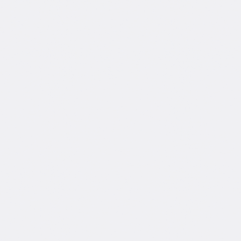

## 👋 Hi, I’m @jolok-banarjee
### 
- 👀 I’m interested in coding. - 🌱 I’m currently Studing B.Sc in Aeronautical Engineering (Aerospace) and learning different programming languages.
- 📫 How to reach me: 
## GitHub: [@jolok-banarjee](https://github.com/jolok-banarjee) LinkedIn: [Jolok Banarjee](https://www.linkedin.com/in/jolok-banarjee-16825b1b7/)

        

 

<!---
jolok-banarjee/jolok-banarjee is a ✨ special ✨ repository because its `README.md` (this file) appears on your GitHub profile.
You can click the Preview link to take a look at your changes.
--->
